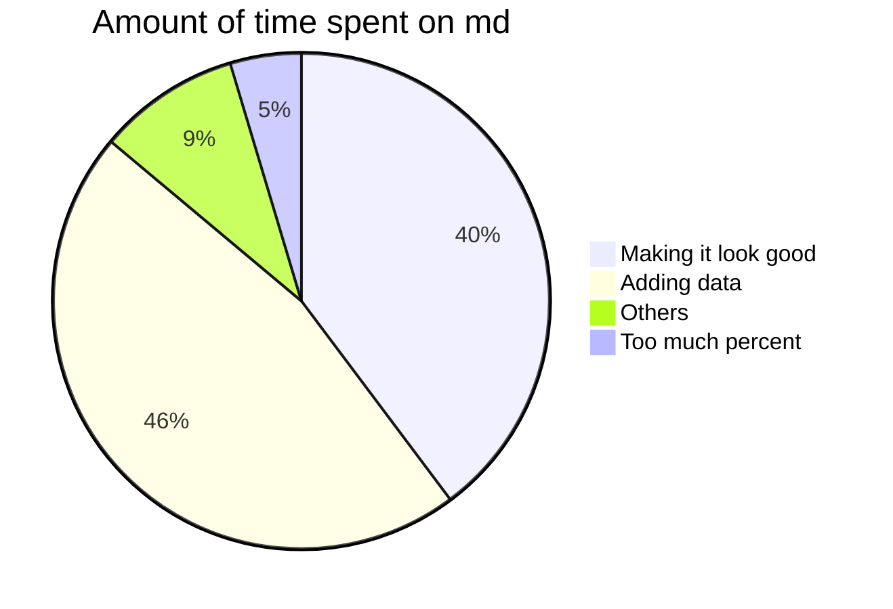

PIE CHART

- [X] Plans at work
    * [X] Make vanilla pudding. Put in mayo jar. Eat in the office during the lunch break
    * [X] Wear shirt that says “Life”. Hand out lemons to colleagues.
    * [ ] Hire two private investigators. Get them to follow each other.
- [ ] Personal plans
    * [X] Make an alcoholic beverage and name it “responsibly.” Start drinking Responsibly.
    * [ ] Sneeze in front of the Pope. Get blessed.
    * [ ] Buy a horse, name it “Oscar Takes The Lead,” enter it in horse races.

***Pros and Cons of the Internet:***
=== "Pros"
    1. Everyone's always on it
    2. Everyone can use it
    3. Anyone can easily share their thoughts
    4. Old friends can find you
    5. Things can go viral
    6. It makes things easily accessible
=== "Cons"
    1. It makes things easily accessible
    2. Things can go viral
    3. Old friends can find you
    4. Anyone can easily share their thoughts
    5. Everyone can use it
    6. Everyone's always on it

