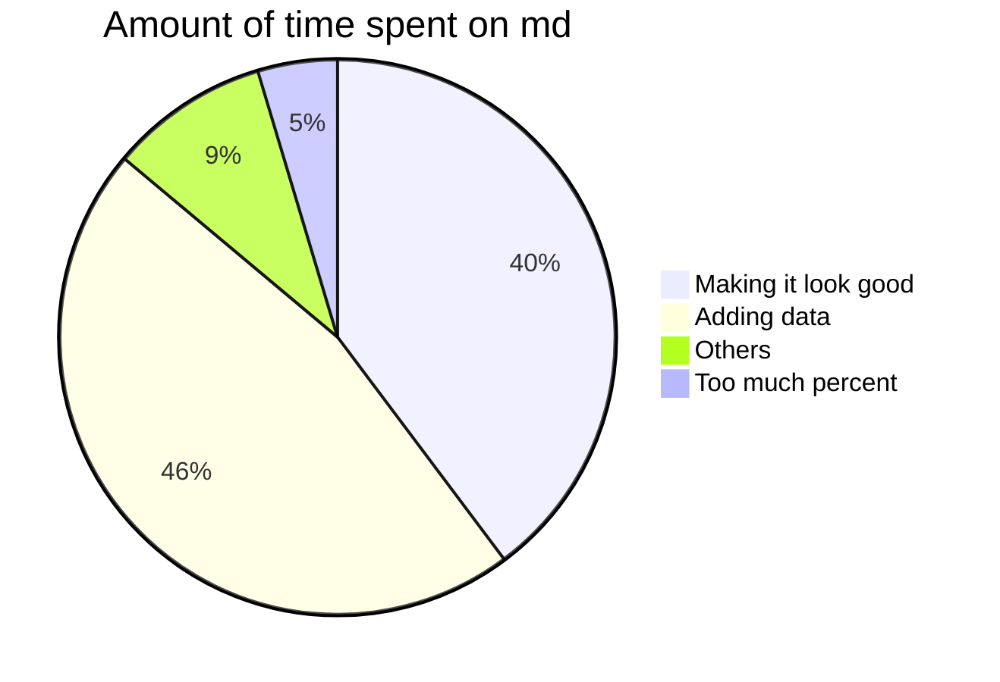

PIE CHART

- [X] Plans at work
    * [X] Make vanilla pudding. Put in mayo jar. Eat in the office during the lunch break
    * [X] Wear shirt that says “Life”. Hand out lemons to colleagues.
    * [ ] Hire two private investigators. Get them to follow each other.
- [ ] Personal plans
    * [X] Make an alcoholic beverage and name it “responsibly.” Start drinking Responsibly.
    * [ ] Sneeze in front of the Pope. Get blessed.
    * [ ] Buy a horse, name it “Oscar Takes The Lead,” enter it in horse races.