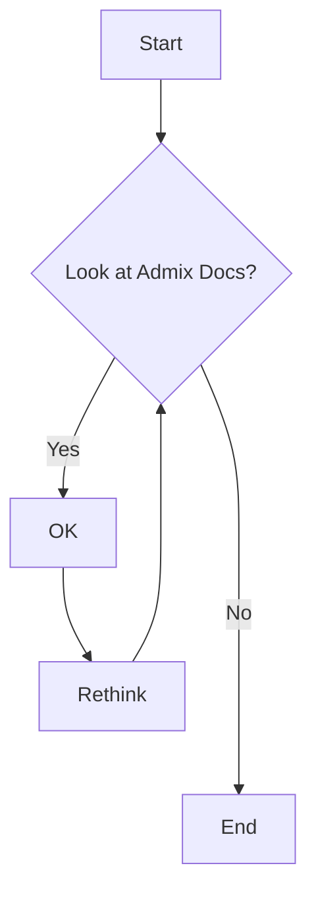

# Admix Test Docs

These are test docs

```
python if x == 1: print("x is 1.") 
```


<style> @keyframes heart { 0%, 40%, 80%, 100% { transform: scale(1); } 20%, 60% { transform: scale(1.15); } } .heart { animation: heart 1000ms infinite; color: red; font-size: 2em; } </style> :octicons-heart-fill-24:{ .heart } :octicons-heart-fill-24:{ .heart } :octicons-heart-fill-24:{ .heart }

!!! note
    In Python we use indentation instead of curly braces:
    ```python
    i = 1
    while i < 6:
        print(i)
        if i == 3:
            break
        i += 1
    ```
    If indentation is wrong, the python code will fail to execute


| **Substance** | **Description**          |
| ------------- | ------------------------ |
| **Table1**    | This is data for table 1 |
| **Table2**    | This is data for table 2 |
| **Table3**    | This is data for table 3 |





:fontawesome-brands-medium: :fontawesome-brands-facebook: :fontawesome-solid-book-open: :fontawesome-regular-snowflake: :material-google-maps: :material-guy-fawkes-mask: :fontawesome-brands-youtube-square: :material-check-circle: :material-arrow-right: :fontawesome-solid-user: :fontawesome-solid-paper-plane: :fontawesome-solid-ship:

:fontawesome-brands-firefox:{style="color: orange; font-size: 40px;"} 


++enter++   ++tab++   ++space++   ++arrow-up++  ++arrow-down++   ++page-up++    ++home++    ++backspace++    ++insert++

++alt++     ++right-alt++   ++left-command++    ++right-control++   ++fn++  ++shift++   ++left-shift++

++pipe++   ++backslash++    ++bar++     ++semicolon++   ++tilde++   ++underscore++

++brace-left++      ++brace-right++     ++bracket-left++    ++bracket-right++   ++double-quote++    ++single-quote++ 

++exclam++  ++comma++   ++equal++   ++less++    ++greater++   ++minus++

++1++   ++f9++   ++q++  ++num0++    ++num1++    ++num-lock++

++ctrl+alt+delete++

