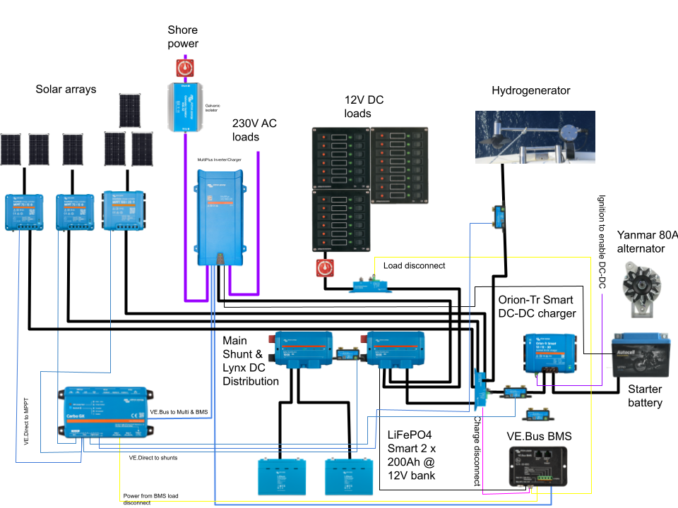
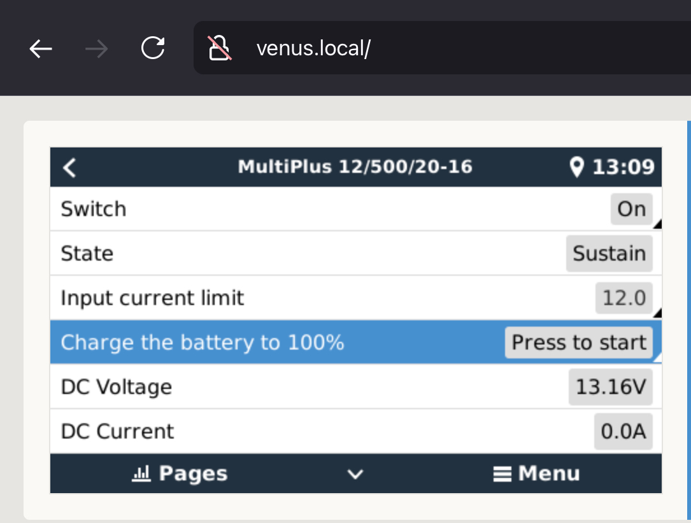

# Electrics

_Lille Ø_ runs both a 12V DC system and a 220V AC system, the latter powered by either shore power or an 500VA onboard inverter.

The battery main switch is located under the navigation station bench.

## Consumption

Typical power consumption on the boat is around 1.4kWh per day in the summer months. In winter and shore power it ranges around 3-6kWh per day depending on how much the diesel heater and the [[engine]] frost guard need to run.

The primary electrical consumers on the boat are:

* Refrigerator
* Starlink
* Engine frost guard
* Diesel heater
* Autopilot
* Personal computers

In situations where batteries are running low, it is a good idea to disable some or all of these. Actual consumption is visible in VictronConnect or VRM.

## Storage

The boat has two battery banks:

* 100Ah lead-acid starter battery located in the port cockpit locker
* 2✕ 200Ah LiFePO4 house bank located under the technical compartment

The two battery banks are normally isolated from each other, except for:

* There is a 40A DC-DC charger to charge house bank from the starter circuit when alternator is running
* The inverter-charger trickle-charges the starter bank from house circuit at 1A when house bank is charging

## Production

### Fixed solar panels

The vessel has three fixed solar arrays:

* 240W array (2×120W panel) on the stern arch
* 120W panel on top of the hatch garage
* 200W array (2×100W panel) on top of the dinghy in the bow

Each of these is connected to its own Victron SmartSolar charge controller.

### FLINsail

The boat carries a deployable 300W [FLINsail](https://flin-solar.de). This is a set of three panels that can be hoisted in the mast like a mainsail.

#### Deploying the FLINsail

* [ ] Attach the FLINsail bag on top of the boom
* [ ] Open the bag and attach the main halyard to the hook labeled _Head_
* [ ] Pull main halyard so that the lines coming from the _Head_ hook are lifted
* [ ] Attach the hook labeled _Clew_ to the end of the boom
* [ ] Attach the hook labeled _Tack_ to the soft shackle hanging under the boom gooseneck
* [ ] Pull main halyard until first panel is over the sail entry gate
* [ ] Attach the sail slide into the mainsail rail
* [ ] Repeat until all three panels are attached to the rail
* [ ] Pull main halyard until all is nice and tight
* [ ] Turn the panels and the boom towards the sun
* [ ] Get the solar MC4 cable from under the deck solar panel and attach to the connectors on the FLINsail

**Note: The maximum wind speed for deploying the FLINsail is 18kt**

### Hydrogenerator

The vessel has a [SailingGen Hydrogenerator](https://sailnsea.1a-shops.eu) mounted in the stern bracket.  This can be used to produce power when sailing faster than 4kt. At around 5kt of speed through water it covers the boat's basic power consumption.

#### Deploying the hydrogenerator

- [ ] Turn on the hydrogenerator controller (switch on the rear bulkhead starboard of the companionway)
- [ ] Untie the hydrogenerator control rope and lower it gently into water
- [ ] Tie the control rope so that the generator is upright
- [ ] Check from controller app or VictronConnect that hydrogenerator is producing power

**Note: stow the hydrogenerator when batteries are full**

### Wind turbine

Lille Ø carries a rigging-suspended [Superwind 350](https://www.superwind.com/en/) wind generator. This is possible to hoist in the foretriangle when at anchor to generate power when the solar panels aren't producing. It starts producing some power at 11kt wind speed.

#### Deploying the wind generator

- [ ] Ensure wind turbine stop switch is in the *Stop* position
- [ ] Attach the upper bracket to the spinnaker pole topping lift, and with the short strop to the inter forestay
- [ ] Connect wind turbine power cables using the MC4 connectors
- [ ] Hoist the turbine to comfortable working height
- [ ] Attach wind turbine tail
- [ ] Attach the three blades
- [ ] Hoist to deployment height (lower bracket just above a raised hand when standing on front hatch)
- [ ] Attach the forward bridle to the two deck pad eyes
- [ ] Attach aft bridle to the ring on the bottom of the mast
- [ ] Tighten topping lift and bridle so that the turbine cannot swing around
- [ ] Turn stop switch to *Run* position

### Alternator

The [[engine]] has been upgraded with a **A2120S** 80A alternator. This charges the starter battery circuit (and house bank via an Orion XS DC-DC charger).

When the engine is running we get about 200W of charge into the house bank.

### Shore power charger

The boat's shore power connection runs to a [Victron MultiPlus 500VA](https://www.victronenergy.com/inverters-chargers/multi-500-va) inverter-charger. Shore power RS692 plug is located in the anchor locker. The shore power CEE cord is typically in the lazarette. There is a CEE to Schuko adapter in the lazarette as needed, as well as an extension cord.

The shore power connection is isolated with a Victron galvanic isolator. This is located next to the shore power main breaker in the hull side of the technical compartment.

The shore power charger is set to [solar priority mode](https://www.victronenergy.com/live/ve.bus:solar-and-wind-priority), meaning that it will only charge batteries if they are very depleted. Otherwise it will only power AC loads and let renewables handle the DC side.
#### Charging batteries to full

- [ ] Ensure shore power is plugged in
- [ ] Open a browser to the [Cerbo GX screen](http://venus.local)
- [ ] Open MultiPlus settings
- [ ] Click *Charge batteries to 100%*
- [ ] Confirm by clicking the *Yes* radio button

## Monitoring

The boat's electrical system can be monitored via:

* [Victron VRM](https://vrm.victronenergy.com) remote monitoring system
* [Electricity Grafana dashboard](http://lille-oe-pi.local:3000/d/6EmAzaA7k/electricity?orgId=1&refresh=30s) on board

