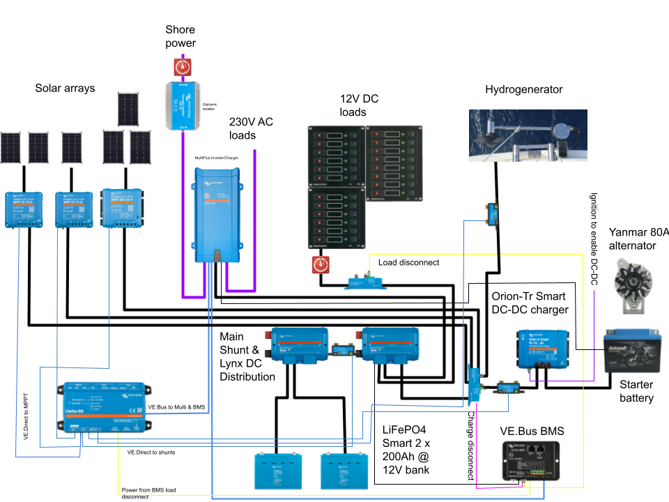

# Electrics

_Lille Ø_ runs both a 12V DC system and a 220V AC system, the latter powered by either shore power or an 500VA onboard inverter.

The battery main switch is located under the navigation station bench.

## Consumption

Typical power consumption on the boat is around 1.2kWh per day in the summer months. In winter and shore power it ranges around 3-6kWh per day depending on how much the diesel heater and the [[engine]] frost guard need to run.

The primary electrical consumers on the boat are:

* Refrigerator
* Engine frost guard
* Diesel heater
* Autopilot
* Personal computers

In situations where batteries are running low, it is a good idea to disable some or all of these.

## Storage

The boat has two battery banks:

* 100Ah lead-acid starter battery located in the port cockpit locker
* 2✕ 200Ah LiFePO4 house bank located under the technical compartment

The two battery banks are normally isolated from each other, except for:

* There is a 30A DC-DC charger to charge house bank from the starter circuit when alternator is running
* The inverter-charger trickle-charges the starter bank from house circuit at 1A when house bank is charging

## Production

### Fixed solar panels

The vessel has two fixed solar arrays:

* 240W array (2×120W panel) on the stern arch
* 120W panel on top of the hatch garage

Each of these is connected to its own Victron SmartSolar charge controller.

### FLINsail

The boat carries a deployable 300W [FLINsail](https://flin-solar.de). This is a set of three panels that can be hoisted in the mast like a mainsail.

#### Deploying the FLINsail

* [ ] Attach the FLINsail bag on top of the boom
* [ ] Open the bag and attach the main halyard to the hook labeled _Head_
* [ ] Pull main halyard so that the lines coming from the _Head_ hook are lifted
* [ ] Attach the hook labeled _Clew_ to the end of the boom
* [ ] Attach the hook labeled _Tack_ to the soft shackle hanging under the boom gooseneck
* [ ] Pull main halyard until first panel is over the sail entry gate
* [ ] Attach the sail slide into the mainsail rail
* [ ] Repeat until all three panels are attached to the rail
* [ ] Pull main halyard until all is nice and tight
* [ ] Turn the panels and the boom towards the sun
* [ ] Get the solar MC4 cable from under the deck solar panel and attach to the connectors on the FLINsail

**Note: The maximum wind speed for deploying the FLINsail is 18kt**

### Hydrogenerator

The vessel has a [SailingGen Hydrogenerator](https://sailnsea.1a-shops.eu) mounted in the stern bracket.  This can be used to produce power when sailing faster than 4kt. At around 5kt of speed through water it covers the boat's basic power consumption.

#### Deploying the hydrogenerator

- [ ] Turn on the hydrogenerator controller (switch in technical compartment)
- [ ] Untie the hydrogenerator control rope and lower it gently into water
- [ ] Tie the control rope so that the generator is upright
- [ ] Check from controller app or VictronConnect that hydrogenerator is producing power

**Note: stow the hydrogenerator when batteries are full**

### Alternator

The [[engine]] has been upgraded with a **A2120S** 80A alternator. This charges the starter battery circuit (and house bank via a DC-DC charger).

When the engine is running we get about 200W of charge into the house bank.

### Shore power charger

The boat's shore power connection runs to a [Victron MultiPlus 500VA](https://www.victronenergy.com/inverters-chargers/multi-500-va) inverter-charger. Shore power cord is located in the anchor locker. It has a CEE plug. There is a CEE to Schuko adapter in the lazarette as needed.

The shore power connection is isolated with a galvanic isolator.

## Monitoring

The boat's electrical system can be monitored via:

* [Victron VRM](https://vrm.victronenergy.com) remote monitoring system
* [Electricity Grafana dashboard](http://lille-oe-pi.local:3000/d/6EmAzaA7k/electricity?orgId=1&refresh=30s) on board

