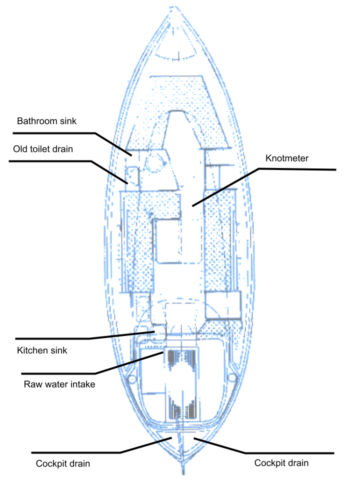

# Plumbing

_Lille Ø_ has both a freshwater and a raw water plumbing system. The toilet is a composting head, and hence there is not black water system on board.

## Seacocks

The deck drains to stern end of cockpit, and from there to sea via the cockpit drain thru-hulls.

The manual and small electric bilge pumps similarly output into the cockpit.
The large capacity electric bilge pump outputs via a through-hull in the stern of the boat.

The raw water intake seacock is located in the engine space. It feeds the engine raw water impeller, as well as the galley sea water tap and the watermaker.

**Note: the bathroom sink seacock must be closed when sailing, it can flow in when heeling over.**

## Freshwater system

The boat has a 200l freshwater tank situated under the v-berth. The deck fill is in the bow.

Fresh water may also be filled inside the cabin using the electric pump and hose under the starboard v-berth. Remember to turn off the pump when the canisters are empty.

The freshwater system is pressurized with a Whale pump located under the v-berth.

There are three outlets:

* Bathroom sink tap
* Galley sink regular tap
* Galley sink filtered tap (filter under the sink)

There is a spare freshwater pump on board. In case of major electrical system failure, the freshwater system can be rerouted to use the galley salt water foot pump.

Fresh water level can be monitored through both Signal K and Victron VRM. 80% means that the tank is full.

## Raw water system

The raw water system has one intake in the engine space. There is a strainer after the seacock, before the system tees off to the three consumers:

* Engine cooling system
* Galley sea water tap (separate shut-off under galley sink)
* Watermaker (separate shut-off under galley sink)

The sea water tap and the watermaker should only be opened in clean sea water. The sea water system is pressurised, with the power button under the sink.

**Note: watermaker and galley freshwater tap should be closed when running the engine to prevent air from entering the system**

## Watermaker

- [ ] Ensure water around the boat is clean (no oil spills, no algae)
- [ ] Ensure engine raw water seacock and the watermaker valve are open
- [ ] Check watermaker filter visually, change or clean as needed
- [ ] Run the watermaker output hose into the sink
- [ ] Start watermaker by turning on the circuit and pressing the power button under the sink
- [ ] Run watermaker for about 10 minutes, then run the output into a cup
- [ ] Test the water quality with TDS meter (should be <300ppm)
- [ ] Taste test the water
- [ ] If passing, move output hose into a canister
- [ ] Log watermaker start time and ppm
- [ ] Run until canister is nearly full
- [ ] Run output again into a cup and test with TDS meter. Log the reading
- [ ] Shut off watermaker and log time and ppm
## Bilge pumps

The boat is equipped with three bilge pumps:

* Manual large capacity pump in the cockpit *(handle in the cockpit locker)*
* Large capacity electric pump in the engine compartment *(switch in navigation station footwell)*
* Small capacity electric pump in the engine compartment *(switch in electric panel)*