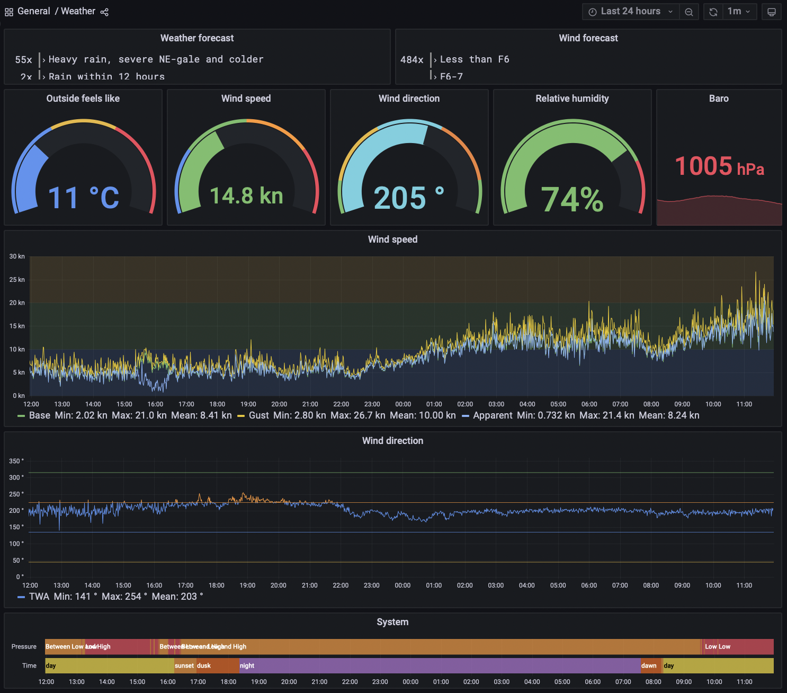

# Weather

The primary source of weather information for _Lille Ø_ is the [Windy weather service](https://www.windy.com). This provides access to all common weather models worldwide.
In most situations **ECMWF** is the preferred weather model.
It is however a good idea to compare the forecasts between the different models, especially when heavier weather is expected.

Choose the [[sails|sail plan]] based on the weather forecast.

## Local weather station

_Lille Ø_ operates also a local weather station, powered by the Ruuvi environmental sensors and the ultrasonic wind sensor. Data from these is channeled to both the NMEA 2000 environment and the local Grafana system.

_Lille Ø_ also reports its conditions to Windy as a [weather station](https://www.windy.com/station/pws-f064d07f).

The [Grafana Weather dashboard](http://lille-oe-pi.local:3000/d/KNkl3x07k/weather?orgId=1&refresh=1m) gives a decent look at current weather conditions at the boat's location:

## Offshore weather

For offshore passages we use the [LuckGrib app](https://luckgrib.com) for weather routing and exploring the forecasted conditions.

Download the latest grib files for the area of interest before the passage and whenever internet is available.

For longer routes, make sure to also consult the [pilot charts](https://www.prevailing-winds.de/) for the current month and region.

